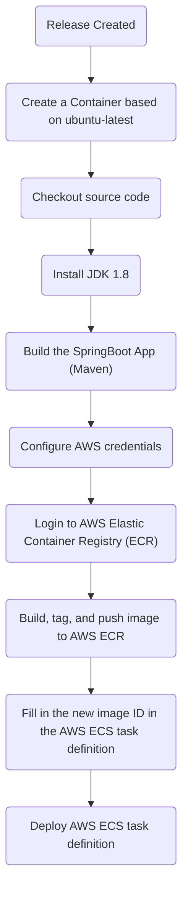

```mermaid

graph TD

A(Release Created) --> B(Create a Container based on ubuntu-latest)

B --> C("Checkout source code")

C --> D(Install JDK 1.8)

D --> E("Build the SpringBoot App (Maven)")

E --> F(Configure AWS credentials)

F --> G("Login to AWS Elastic Container Registry (ECR)")

G --> H(Build, tag, and push image to AWS ECR)

H --> I(Fill in the new image ID in the AWS ECS task definition)

I --> J(Deploy AWS ECS task definition)

```